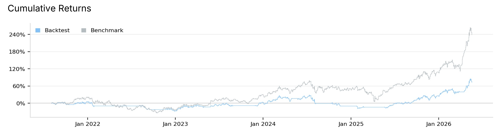
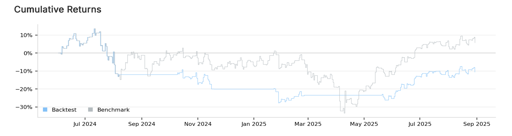
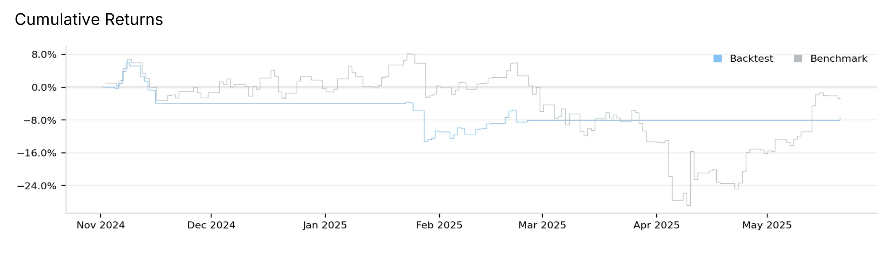

# SMA Golden/Dead-Cross Strategy: QuantConnect Backtest Validation

This project is the direct follow-up to [soxx-semiconductor-analysis](https://github.com/se9592001-jpg/soxx-semiconductor-analysis) — see Problem Statement below for what that project found and why it led here, and Related Work for how the two connect.

## Table of Contents

1. [Key Findings](#key-findings)
2. [Problem Statement](#problem-statement)
3. [Data Source](#data-source)
4. [Methodology](#methodology)
5. [Results](#results)
6. [Interpretation](#interpretation)
7. [Limitations](#limitations)
8. [Conclusion](#conclusion)
9. [Further Studies](#further-studies)
10. [Running This Code](#running-this-code)
11. [Related Work](#related-work)

## Key Findings

- **In a steadily uptrending market, simply buying and holding beats this strategy outright.** In the SOXX 20/60 base case, $100k in buy-and-hold grew to $336.5k while the same $100k traded through the strategy only reached $172.4k over the same period (+236.50% vs. +72.38%) — buy-and-hold outperforms the strategy in 6 of the 7 configurations tested overall.

*Backtest vs SOXX buy-and-hold benchmark, full period 2021–2026.*

- **The strategy's one real strength — cutting losses during a crash — gets erased by the same lag that hurts it in uptrends.** In the two corrections where the market fell hard (2024–25, DeepSeek), the dead-cross exit did limit the drawdown compared to buy-and-hold. But because the signal is slow to turn back on, the strategy stayed in cash through each recovery and still ended the window behind buy-and-hold.
- **The one case that looked like a win (SOXX 50/200) isn't reliable**: PSR of just 24.68% on only 7 trades, more likely a fit to this specific dataset than a real edge.

## Problem Statement

A prior pandas-based analysis ([soxx-semiconductor-analysis](https://github.com/se9592001-jpg/soxx-semiconductor-analysis)) found that a 20/60-day SMA golden-cross signal on SOXX showed no statistically significant edge over baseline returns (t-test, p > 0.05). That test, however, only compared the signal's forward returns to the average return from a random N-day holding window — it didn't simulate an actual portfolio, so it left out capital allocation, slippage, commissions, and compounding entirely.

This project checks whether that no significant edge conclusion survives a much stricter test: a full QuantConnect (LEAN) portfolio simulation with real position sizing, automatic slippage/commission modeling, and compounding equity, rather than the simplified return-averaging approach used in the original pandas study. It also goes further than the original study by checking whether the conclusion generalizes — or whether an edge appears somewhere the pandas test didn't look.

The goal is to stress-test the original finding under (1) different parameter choices, (2) a different underlying asset, and (3) distinct market regimes (two slower multi-month corrections — the 2022 rate-hike selloff and the 2024–25 semiconductor-sector correction — plus one sharp single-event selloff/recovery isolated within that same window, the January–May 2025 DeepSeek shock) — not to prove or disprove it — and to report what actually happened in each case.

## Data Source

- **Instruments:** SOXX (iShares Semiconductor ETF), QQQ (Invesco NASDAQ-100 ETF)
- **Resolution:** Daily
- **Platform:** QuantConnect LEAN Engine (cloud backtesting), $100,000 starting capital
- **Full-period range:** 2021-08-02 to 2026-05-18 (~5 years)
- **Regime sub-periods:** selected from SOXX's price chart based on visually identified drawdown/recovery cycles (see Limitations)

Note on the end date: main.py asks for 2026-07-30 as the end date, but QuantConnect automatically holds back the most recent 90 days as an out-of-sample buffer, to stop people from overfitting to data they've already seen. So in practice, every backtest here actually stops at 2026-05-18. That also means these results run a bit shorter than the original pandas-based study, which went all the way to 2026-07-30 — see Limitations for why that gap doesn't change the conclusions.

## Methodology

**Signal:** Classic golden-cross / dead-cross on two SMAs (`fast_period`, `slow_period`, exposed as QuantConnect parameters). A position is opened at 100% of equity when the fast SMA crosses above the slow SMA, and fully liquidated when it crosses back below. Cross detection uses a state-gate (`is_holding`) comparing the current fast and slow relationship against the prior bar, so only genuine crossovers trigger trades, not every bar where fast > slow.

**Baseline:** A custom "Buy & Hold" equity curve is computed and plotted alongside the strategy (`initial_price` captured on the first bar the algorithm receives data for, then `100,000 × current_price / initial_price`), rather than adopting QuantConnect's default price-only benchmark chart. Because warm-up data is fed to the algorithm before the official start date, `initial_price` is actually set a few weeks before the backtest's visible start — this doesn't affect the reported percentage returns (the ratio cancels it out), but it does mean the dollar values plotted on the chart don't start exactly at $100,000. This baseline is also price-return only and doesn't add back dividends (see Limitations).

**Costs:** No explicit brokerage/fee model was configured. QuantConnect's default trade fee and slippage models are applied automatically to every order, so trading costs are reflected in net results even without manual configuration. Total fees ranged from $10.89 (DeepSeek period, 5 orders) to $131.00 (SOXX 10/30, 43 orders) across the seven different configurations.

**Validation axes tested:**

1. **Parameter robustness** — same SOXX signal at (20,60), (10,30), (50,200)
2. **Asset generalization** — same (20,60) signal applied to QQQ
3. **Regime robustness** — same SOXX (20,60) signal isolated to three distinct market conditions: the 2022 correction, a 2024–2025 semiconductor-sector correction, and the January–May 2025 DeepSeek-driven selloff and recovery

## Results

| Run                            | Period            | Return      | Baseline (Buy&Hold) Return | Sharpe    | PSR        | Max Drawdown | Win Rate | Orders |
| ------------------------------ | ----------------- | ----------- | -------------------------- | --------- | ---------- | ------------ | -------- | ------ |
| SOXX 20/60 (base case)         | 2021-08 – 2026-05 | 72.38%      | 236.50%                    | 0.302     | 2.88%      | 36.8%        | 40%      | 21     |
| SOXX 10/30                     | 2021-08 – 2026-05 | 90.54%      | 236.50%                    | 0.378     | 4.21%      | 36.4%        | 43%      | 43     |
| SOXX 50/200                    | 2021-08 – 2026-05 | **257.56%** | 236.50%                    | **0.844** | **24.68%** | 24.7%        | 100%     | 7      |
| QQQ 20/60                      | 2021-08 – 2026-05 | 19.50%      | 99.27%                     | −0.069    | 0.23%      | 31.5%        | 36%      | 23     |
| SOXX 20/60, 2022 correction    | 2021-12 – 2023-07 | 1.18%       | 3.75%                      | −0.019    | 5.68%      | 32.4%        | 33%      | 7      |
| SOXX 20/60, 2024–25 correction | 2024-06 – 2025-08 | −10.61%     | 5.58%                      | −0.491    | 2.03%      | 36.3%        | 0%       | 7      |
| SOXX 20/60, DeepSeek period    | 2024-11 – 2025-05 | −7.46%      | −3.82%                     | −1.06     | 1.52%      | 18.1%        | 0%       | 5      |

**Key observations:**

- **Baseline (buy-and-hold) beat the strategy in 6 of 7 runs.** Only the (50,200) parameter combination outperformed its own baseline, and it did so on a sample of just 7 trades — this looks more like a single fortunate combination on this specific window than a robust edge (see Limitations).
- **Strategy underperformed baseline in all three isolated regime windows, and the same pattern shows up twice.** In the 2022 correction, both were positive but the strategy captured less of the gain (+1.18% vs. +3.75%). In the 2024–25 correction and the DeepSeek selloff, the same failure mode repeats: because the signal is a lagging indicator, the prior dead cross blocks the sharpest part of the plunge (strategy trough −27.7% vs. baseline's −33.5% in the 2024–25 case; −8% vs. −29% in DeepSeek), but that same lag delays re-entry once the market turns, so the strategy misses each sharp recovery and ends the window behind buy-and-hold (−10.61% vs. +5.58%, and −7.46% vs. −3.82%, respectively).

*Backtest vs SOXX benchmark, June 2024–August 2025. The strategy posted an outright loss (−10.61%) while the benchmark ended positive (+5.58%), even though the benchmark fell further at its own trough.*

*Backtest vs SOXX benchmark, the January–May 2025 DeepSeek selloff and recovery. The strategy avoided most of the April 2025 drawdown but stayed in cash through the recovery, ending the window behind the benchmark (−7.46% vs. −3.82%).*

- **Win rate collapsed to 0% in both recent correction windows** (2024–25 correction and DeepSeek) — every trade taken in those windows was a loser.
- **QQQ produced a negative Sharpe and Alpha**, a more clearly negative result than SOXX's base case, reinforcing that the signal's weak performance isn't SOXX-specific.

**On PSR (Probabilistic Sharpe Ratio):** Even the conventional default (SOXX 20/60, Sharpe 0.302) has a PSR of only 2.88%, meaning there's very little confidence that this Sharpe Ratio reflects a real, repeatable edge rather than chance. This lines up with the original pandas-based study's t-test result (p > 0.05). Both the significance test on raw returns and PSR arrive at the same conclusion through independent methods. (The one configuration with a high PSR, SOXX 50/200, is addressed separately in Limitations #6 — its result rests on only 7 trades, too few to trust regardless of the PSR figure.)

## Interpretation

Consistent with the theoretical property of SMA crossovers as **lagging indicators** — they buy after an uptrend is already established and sell after a decline has already occurred — the strategy structurally struggles to outperform buy-and-hold on assets with strong secular uptrends (both SOXX and QQQ over this window). The strategy's downside-protection performance is more mixed. In the two significant corrections (2024–25 and specifically DeepSeek), the dead-cross exit did avoid the worst of the loss compared to the benchmark. But because the signal lags, the strategy still ends up with a lower return, or an even larger loss, than the benchmark once the benchmark recovers and turns positive again.

This is consistent with, and extends, the original study's conclusion. The earlier analysis found no statistically significant return edge over a random-holding-period baseline. Similarly, this QuantConnect analysis shows that even a full portfolio simulation — with position sizing, compounding, and transaction costs — doesn't show a practical edge either. The dead-cross exit is meant to reduce losses during a decline, and in two real cases, it does exactly that. The problem shows up afterward: the signal doesn't turn the strategy back on quickly enough once the market bottoms, so by the time it re-enters, the benchmark has already recovered most of what it lost.

## Limitations

1. **Two different "baseline" definitions across the two projects.** The original study's baseline was the *average return from holding a random N-day window*, not a full buy-and-hold. This QuantConnect baseline is a true buy-and-hold equity curve. The two answer different questions — "is the signal better than typical short-term holding periods?" versus "would you have been better off never touching your position?" — so they aren't directly comparable numbers.

2. **Pandas and QuantConnect studies don't cover identical end dates.** The pandas study runs through 2026-07-30; QuantConnect caps every result here at 2026-05-18 due to its 90-day out-of-sample holdout (not disableable on this account tier), not a coding choice. This ~10-week gap only affects the four full-period runs (SOXX 20/60, SOXX 10/30, SOXX 50/200, QQQ 20/60) — the regime-specific runs (2022, 2024–25, DeepSeek) use their own fixed date ranges and aren't affected. Whether the missing weeks would change the full-period conclusions is untested and left open here.

3. **Baseline excludes dividends.** The manually-computed Buy & Hold curve is driven by price-return only. SOXX and QQQ dividend yields (~0.5–1%/yr) aren't added back, so the reported baseline slightly understates true buy-and-hold performance.

4. **Small sample sizes in regime tests.** The three isolated regime windows produced only 5–7 trades each, too few for a statistically meaningful significance test. No p-value is reported for these sub-windows; the low PSR values (1.5–5.7%) are used instead as a rough sign that these Sharpe Ratios aren't reliable estimates.

5. **Regime windows were chosen by visual inspection, not by an objective, pre-specified rule.** Each drawdown's start, trough, and recovery point was identified by eye on SOXX's price chart. This means the window selection could have been influenced by already knowing how the price moved. However, the result found here (the strategy performs worse than buy-and-hold during corrections) is the opposite of what selecting favorable windows would have produced, which reduces the concern to some degree.

6. **No formal walk-forward validation.** The three parameter combinations weren't chosen through a systematic search-and-test process. (20,60) is just the common default for this kind of signal. (10,30) and (50,200) were added afterward to see how sensitive the results are to the parameter choice, not because a search process picked them as optimal. This matters most for the (50,200) result: it looks the best of the three, but since it was never tested on data separate from where it was picked, there's no way to tell whether that's a real effect or just this one result fitting this one dataset well.

7. **Two-asset, single-window evidence.** SOXX and QQQ overlap heavily (both are tech-heavy) and were tested over the same five-year period, which was a strong uptrend the whole way through. So this project really tested one market condition twice rather than two completely independent cases. The finding that trend-following underperforms buy-and-hold during strong uptrends holds up in theory and was consistent here, but whether it holds for assets outside tech, or for periods that aren't uptrends, hasn't been tested.

8. **Return comparison doesn't fully account for differing risk exposure.**  Baseline is 100% invested throughout, while the strategy holds cash during dead-cross periods and is therefore exposed to less market risk overall. 
Only the strategy's Sharpe Ratio is reported here; a baseline Sharpe Ratio was not computed, so the return comparison in Key Findings, while accurate in dollar terms, isn't a fully risk-adjusted comparison.

## Conclusion

- No practical edge was found in any of the seven configurations tested, consistent with the original pandas study.
- The one case where the strategy beat its baseline (SOXX 50/200) had a very low PSR (24.68%) on only 7 trades, so it looks more like a fit to this specific dataset than a real, repeatable edge.
- The signal's lagging nature explains most of the results: it buys and sells too late to keep up with SOXX and QQQ's strong uptrend, and during corrections it limits losses on the way down but misses the recovery on the way back up.

## Further Studies

- **Test a genuinely non-trending period.** Every asset and window tested here was in a secular uptrend. A range-bound or sideways period — not just a different ticker, but a specific historical stretch where the underlying asset didn't trend in either direction — would show how the signal performs without a trend to follow.
- **Add a broader-market asset, e.g. SPY.** This would reduce reliance on two correlated, tech-heavy instruments (Limitations #7). Worth noting: SPY covered the same 2021–2026 window and was also in a strong uptrend, so on its own it addresses the correlation concern above, not the non-trending-period question.
- **Combine the signal with a second indicator, such as RSI**, to see whether filtering out weak crossovers changes the outcome (planned in the original pandas project's Next Steps).
- **Run a proper walk-forward optimization** instead of testing a fixed set of parameter combinations, to address Limitations #6.

## Running This Code

This algorithm is written for QuantConnect's LEAN engine (`from AlgorithmImports import *`) and can't be run as a standalone Python script — `AlgorithmImports` is provided by the LEAN runtime, not by a pip-installable package. To run it, use either:

- A [QuantConnect](https://www.quantconnect.com) account (free tier supports cloud backtesting), or
- [LEAN CLI](https://www.quantconnect.com/docs/v2/lean-cli) with Docker for local execution

Parameters (`fast_period`, `slow_period`) and the backtest date range (`set_start_date`/`set_end_date`) can be changed directly in `main.py`, or `fast_period`/`slow_period` overridden via QuantConnect's Parameters panel without editing code. Note that the actual end date used will still depend on the account's out-of-sample holdout setting (see Limitations #2).

## Related Work

- `results/` holds the raw JSON backtest output for all 7 runs; `reports/` includes the full QuantConnect PDF strategy reports for the two most illustrative runs (QQQ case and SOXX DeepSeek period).
- [soxx-semiconductor-analysis](https://github.com/se9592001-jpg/soxx-semiconductor-analysis) — the pandas-based exploratory analysis (correlation, volatility, signal validation via t-test) that this project's Problem Statement is built on.